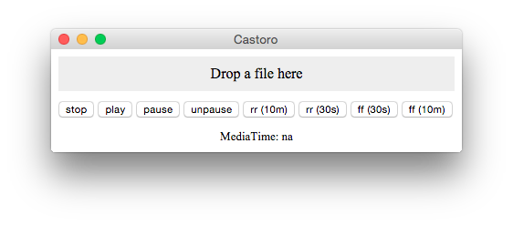

Description
-----------

A commandline tool to cast local files to chromecast. Device discovery, volume
control, seeking support, automatic subtitles loading based on media filename,
audio transcoding. Experimental user interface is being worked on.

Install
-------

You can user npm published version
    
    npm install -g castoro

or roll one yourself from this repo

    npm install -g coffee-script
    cd [this repo]
    npm run-script prepublish
    npm install -g

Usage
-----

Command line usage goes like this

      castoro \
        --mode [original|stream-transcode|transcode] \
        --input [path/to/file.mkv]

Optional arguments

        --ip [ip of your machine]
        --port [http port to use]
        --cli-controller # enables cli controller

### Mode(s)

#### "original"

The tool will stream un-modified input file using HTTP. Since chromecast is
picky about formats (expecially audio ones) the file must be properly encoded.

#### "stream-transcode" (default)

The tool will live transcode the input file to fit chromecast audio capabilities
using ffmpeg. <s>At the moment this disables seeking support.</s> Now there is
experimental seek support.

#### "transcode"

The tool will

1. start to cast the input media to the chromecast using stream-transcode mode
   (no seeking enabled)
2. start a transcoding process converts the entire input media
3. as soon as the transcoding (2) is finished it will switch playback to the
   trascoded file (seeking will be re-enabled)

### Cli controller

If you enable the cli controller you can use keys to control playback/volume
right from the console

- Up: Volume up
- Down: Volume down
- Left: RR (10 min)
- Shift+Left: RR (1 min)
- Right: FF (10 min)
- Shift+Right: FF (1 min)
- Space: Pause/Unpause
- key "s": Print player status
- key "q": Quit

### UI Controller (Experimental)

Experimental UI allows drag-dropping video files and control playback as a
desktop application. See screenshots

Current status of UI support is

- still very experimental
- using [electron.atom.io](http://electron.atom.io)
- tested on Mac OSX

To test it you can clone this repo and then use

    npm run-script prepublish; electron .

FFMPEG dependency
-----------------

This tool uses FFMpeg. FFMpeg must be installed on the system. I run it on OSX
where I installed ffmpeg using Homebrew like this

    brew install ffmpeg --with-faac --with-fdk-aac

Todos
-----

Pull requests are welcome

- Also transcode video when needed (currently we just transcode audio)
- Automatically figure out available port
- Support multiple chromecasts in the same network
- Distrubuted bundled application with UI and possibly ffmpeg binaries

